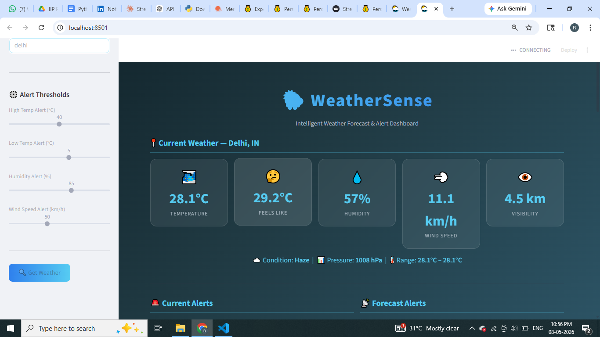
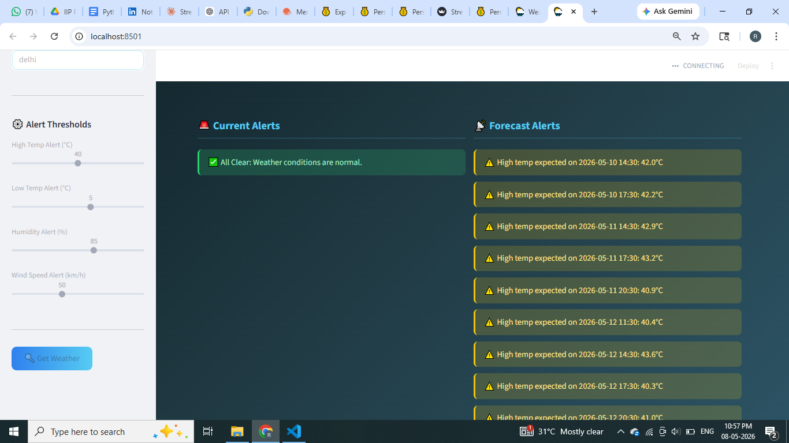
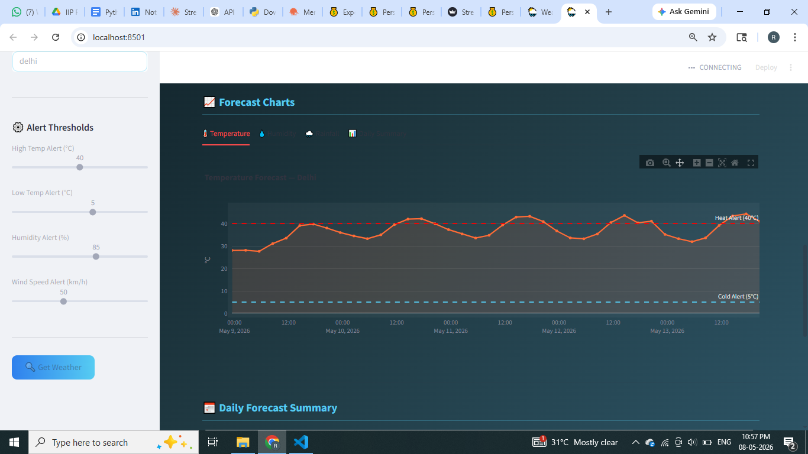
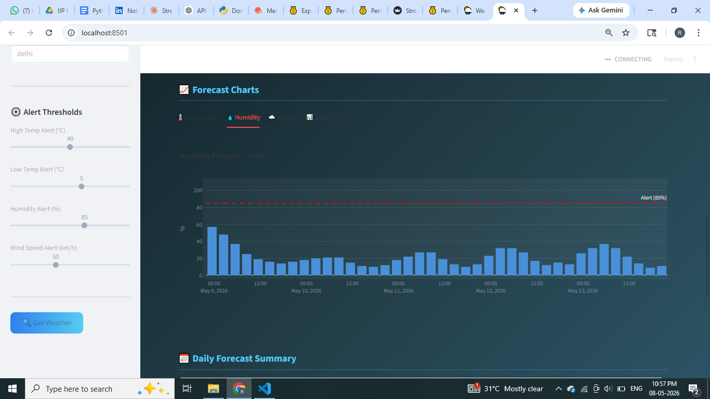
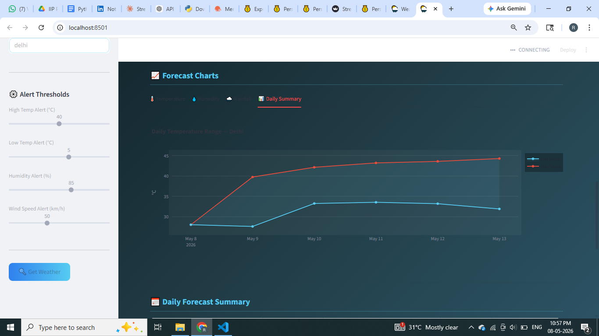
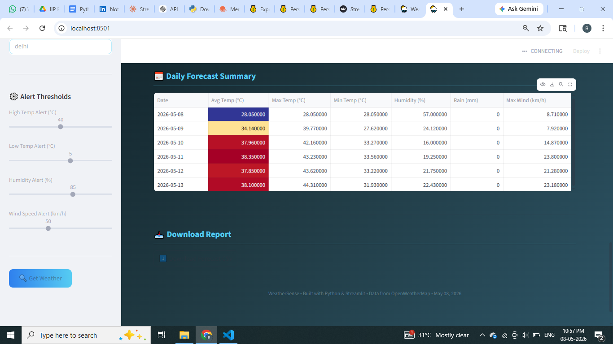
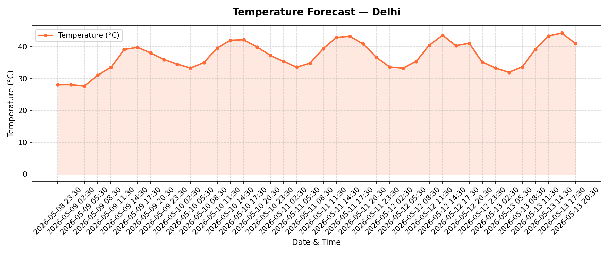
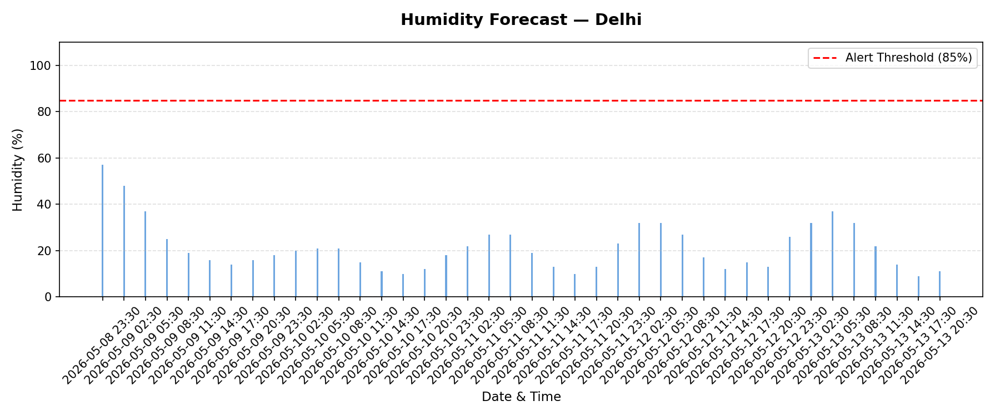
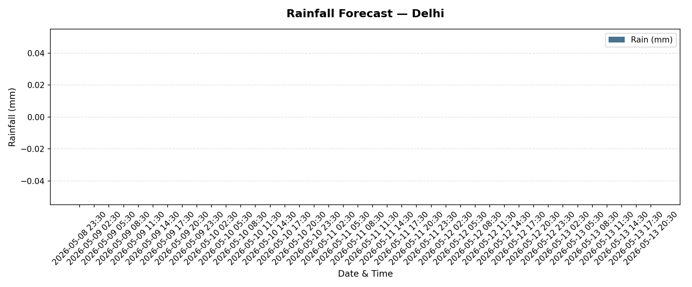
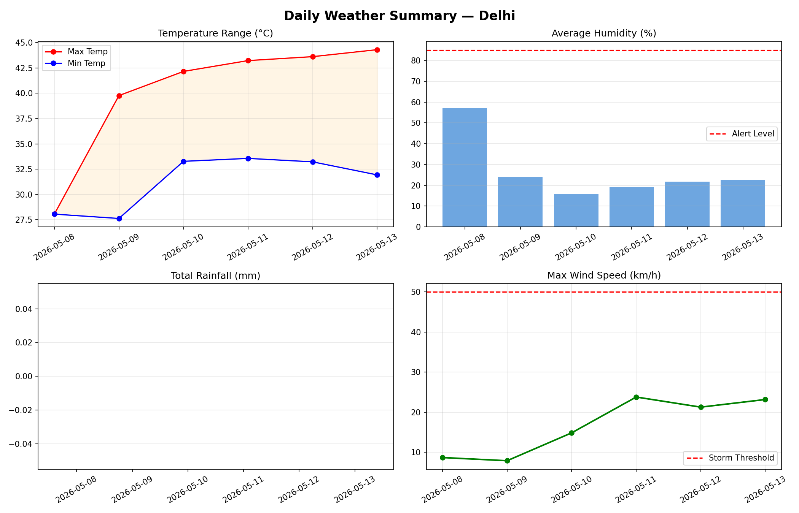

# 🌦️ Weather Forecast & Alert Application

> **An intelligent Python-based weather monitoring system with real-time API integration, threshold-based alert logic, data visualization, and an interactive Streamlit dashboard.**


---

## 📌 Problem Statement

Weather affects nearly every aspect of human activity — from agriculture and logistics to travel and daily planning. Most users rely on generic apps without the ability to set custom alert thresholds or generate downloadable reports. This project builds a programmable weather system that fetches live data, detects dangerous conditions, generates visual forecasts, and exports structured reports — all customizable per user requirements.

---

## 🏭 Industry Relevance

| Sector | Application |
|---|---|
| Agriculture | Rain/drought alerts for irrigation decisions |
| Logistics | Route planning around storm warnings |
| Event Planning | Outdoor event safety checks |
| Travel | Weather-aware itinerary planning |
| Smart Cities | Automated municipal weather advisories |

---

## ✨ Features

- 🌐 **Live API Mode** — Real-time data from OpenWeatherMap
- 🧪 **Simulation Mode** — Works without API key using sample data
- 🚨 **Smart Alert System** — Heat, cold, humidity, rain, storm alerts
- 📈 **Interactive Charts** — Temperature, humidity, rainfall, wind trends
- 📅 **5-Day Forecast** — Daily summary with min/max analysis
- 📥 **CSV Report Export** — Download structured weather data
- 🖥️ **Streamlit Dashboard** — Full dark-themed web interface
- ⚙️ **Configurable Thresholds** — Adjust alert levels via sidebar sliders

---

## 🛠️ Tech Stack

| Component | Technology |
|---|---|
| Language | Python 3.10+ |
| API | OpenWeatherMap (free tier) |
| HTTP Requests | requests |
| Data Analysis | Pandas |
| Visualization | Matplotlib, Plotly |
| Dashboard | Streamlit |
| Config/Security | python-dotenv |

---

## 📁 Folder Structure

```
Weather-Forecast-Alert-Application/
├── data/                    ← Sample JSON for simulation
├── src/                     ← Python modules
│   ├── api_handler.py
│   ├── data_parser.py
│   ├── forecast_analyzer.py
│   ├── alert_system.py
│   ├── visualizer.py
│   └── report_generator.py
├── outputs/                 ← Generated charts (PNG)
├── reports/                 ← Generated CSV reports
├── images/                  ← Screenshots for README
├── streamlit_app.py         ← Dashboard entry point
├── main.py                  ← CLI entry point (API mode)
├── simulate.py              ← CLI entry point (simulation mode)
├── requirements.txt
├── .env.example
├── .gitignore
└── README.md
```

---

## ⚙️ API Setup

1. Register at [openweathermap.org](https://openweathermap.org) (free)
2. Copy your API key from the **API Keys** tab
3. Create a `.env` file in the project root:
```
OPENWEATHER_API_KEY=your_api_key_here
```
4. Wait 10–15 minutes for the key to activate

> ⚠️ Never commit your `.env` file. It is listed in `.gitignore`.

---

## 🚀 How to Run

### Install Dependencies
```bash
pip install -r requirements.txt
```

### Simulation Mode (No API key needed)
```bash
python simulate.py
```

### Live API Mode
```bash
python main.py
```

### Streamlit Dashboard
```bash
streamlit run streamlit_app.py
```

---

## 📊 Sample Output

```
📍 City       : Bengaluru, IN
🌡️ Temperature : 38.5°C (Feels like 42.0°C)
💧 Humidity   : 88%
💨 Wind Speed : 54.7 km/h
☁️ Condition  : Thunderstorm with heavy rain

🚨 ALERTS:
  🔴 HEAT ALERT: Temperature is 38.5°C
  💧 HUMIDITY ALERT: Humidity is 88%
  💨 STORM ALERT: Wind speed is 54.7 km/h
  🌧️ WEATHER ALERT: Thunderstorm with heavy rain detected!
```

---

## 📸 Screenshots

| Feature | Preview |
|---|---|
| Dashboard Home | 
|  | 
|  | 
|  | |


| Temperature Chart |  |
| Humidity Chart |  |
| Rain Chart |  |
| daily summary Chart |  |


---

## 🎬 Demo Video
[▶️ Watch Demo ](https://drive.google.com/file/d/YOUR_FILE_ID/view)


## 🎓 Learning Outcomes

- REST API integration using `requests`
- JSON parsing and data extraction
- Pandas DataFrame manipulation
- Matplotlib/Plotly data visualization
- Threshold-based alert logic design
- Streamlit dashboard development
- Environment variable management with `python-dotenv`
- Git/GitHub project documentation

---

## 👤 Author

**Rakshitha A S**  


---

## 📄 License

MIT License — Free to use for educational and portfolio purposes.
